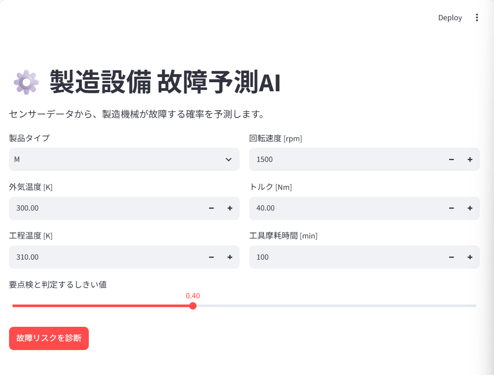
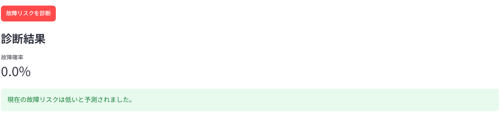
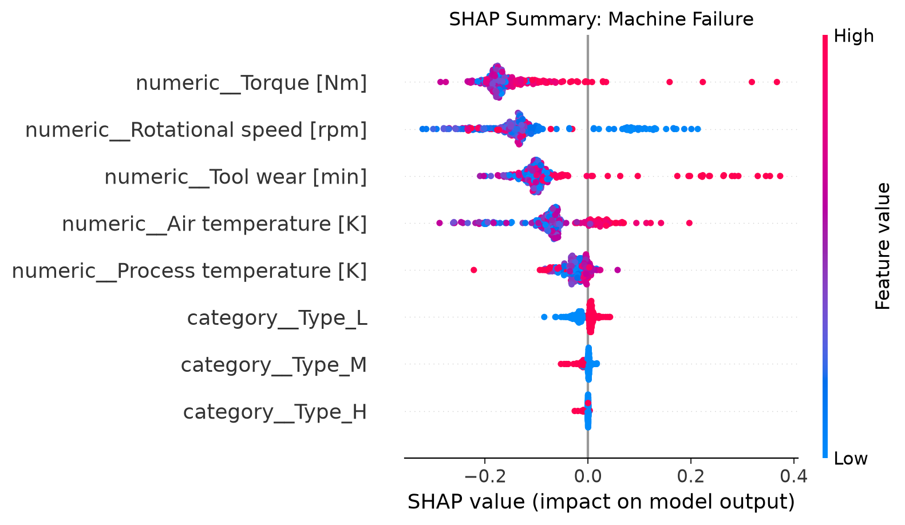
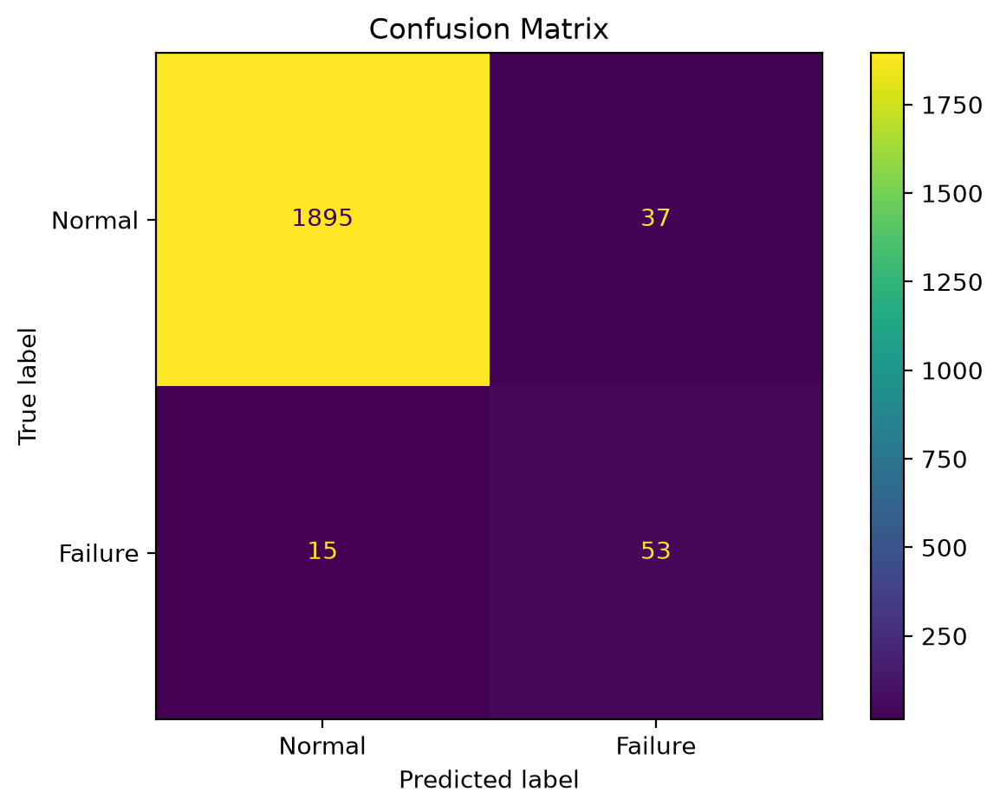
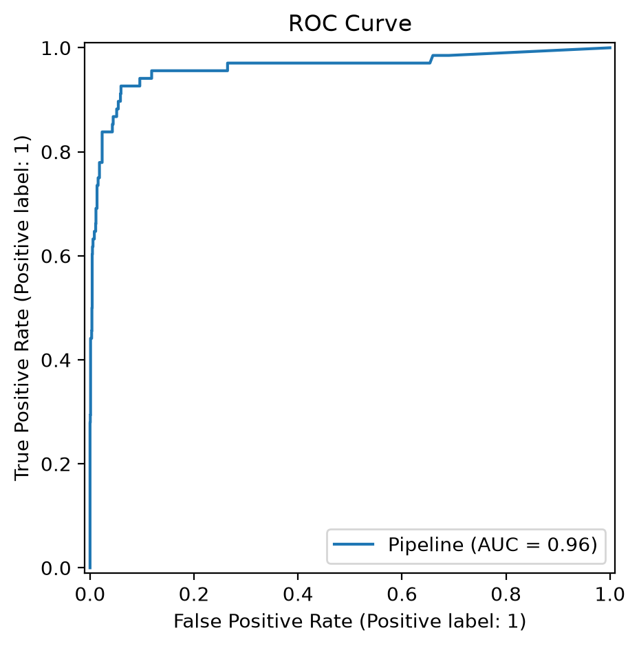
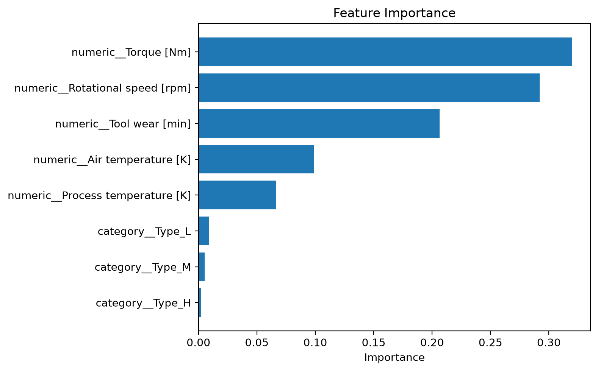

# 🚀 Demo

## Application



## Prediction



## SHAP



# ⚙️ Predictive Maintenance AI

製造設備のセンサーデータから故障リスクを予測する機械学習Webアプリケーションです。

設備の異常を早期に検知し、予防保全（Predictive Maintenance）を支援することを目的として開発しました。


---

# 📌 Overview

本プロジェクトでは、AI4I 2020 Predictive Maintenance Dataset を用いて製造設備の故障を予測するAIを開発しました。

学習済みモデルをWebアプリ化し、センサーデータを入力するだけで故障確率を確認できます。

---

# 🎯 Purpose

製造設備では突然の故障による生産停止が大きな損失につながります。

本プロジェクトでは

- 故障リスクの可視化
- 予防保全支援
- データに基づく保守判断

を目的として機械学習モデルを開発しました。

---

# ✨ Features

- Random Forestによる故障予測
- StreamlitによるWebアプリ
- センサーデータ入力
- 故障確率表示
- 点検推奨判定
- Joblibによるモデル保存
- SHAPによる予測根拠の可視化
---

# 🖥️ Application

以下の入力値から故障確率を予測します。

- Product Type
- Air Temperature
- Process Temperature
- Rotational Speed
- Torque
- Tool Wear

## アプリ画面


---

# 🧠 Machine Learning

## Model

- Random Forest Classifier

## Training

- Train / Test Split (80/20)
- OneHotEncoder
- Scikit-learn Pipeline
- Joblib Model Persistence

## Explainable AI

- SHAP (SHapley Additive exPlanations)
- Feature Importance Analysis

---

# 📊 Model Evaluation

## Confusion Matrix



## ROC Curve



## Feature Importance



---


---

# 🏗️ System Architecture


---

# 📂 Project Structure

```text
predictive-maintenance-ai
│
├── app
│   └── app.py
│
├── data
│   ├── ai4i2020.csv
│   └── README.txt
│
├── images
│   ├── app-screen.png
│   ├── confusion-matrix.png
│   ├── roc-curve.png
│   ├── feature-importance.png
│   └── architecture.png
│
├── models
│
├── src
│   ├── train.py
│   ├── predict.py
│   └── features.py
│
├── tests
│
├── README.md
└── requirements.txt
```

---

# ⚙️ Tech Stack

## Programming Language

- Python

## Machine Learning

- scikit-learn
- pandas
- NumPy

## Visualization

- Matplotlib

## Web Application

- Streamlit

## Development

- Git
- GitHub
- VS Code

---

# 🚀 How to Run

```bash
git clone https://github.com/makun212/predictive-maintenance-ai-2026.git

cd predictive-maintenance-ai

python -m venv .venv

source .venv/Scripts/activate

pip install -r requirements.txt

python -m src.train

streamlit run app/app.py
```

---
# 📄 Dataset

This project uses the **AI4I 2020 Predictive Maintenance Dataset**
provided by the **UCI Machine Learning Repository**.

https://archive.ics.uci.edu/dataset/601/ai4i+2020+predictive+maintenance+dataset

# 💡 Future Improvements

- CSV Batch Prediction
- FastAPI
- Docker
- AWS Deployment
- LLM Maintenance Report

---

# 👨‍💻 What I Learned

このプロジェクトを通して以下を学びました。

- 機械学習モデルの構築
- データ前処理
- モデル評価
- Webアプリ開発
- Git/GitHubによるバージョン管理

---

## SHAP Summary

SHAP (SHapley Additive exPlanations) を利用して、
モデルが故障と判断した理由を可視化しています。

これにより、単なる予測だけでなく、
各特徴量が予測結果へ与える影響も確認できます。


Tokyo University of Science

Faculty of Science and Technology

Department of Information and Computer Science

Interests

- Machine Learning
- Data Science
- Generative AI
- Predictive Maintenance
